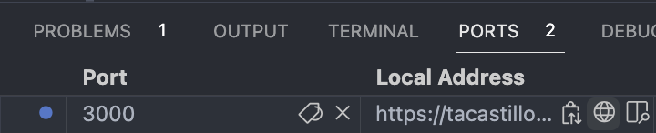

# Getting Started with Dagster and GitHub Codespaces

## Running Dagster

To run Dagster, navigate to the Terminal tab below and run `dagster dev`. Your Dagster instance will start up.

To get to the Dagster UI, navigate to the Ports tab next to the Terminal tab, hover over the Local Address in row for port 3000, and click on the globe icon to open it in a new tab.

This codespace comes with all of Dagster's Python dependencies pre-installed, along with any dependencies found in `setup.py`.

> **Note**
> If you're feeling fancy, you can also click on the two-panel icon next to the globe icon to open the Dagster UI in a split pane view within GitHub Codespaces.

## What is GitHub Codespaces?

GitHub Codespaces is a cloud-hosted IDE. It's a fully-featured version of Visual Studio Code connected to your GitHub account.

Saving your code will be stored across Codespace sessions. You'll also be able to commit and raise pull requests from within the IDE.

Refer to the Codespaces [documentation](https://docs.github.com/en/codespaces) to learn more.

## Pricing and turning off your Codespace

Keeping Dagster running in a Codespace will keep the Codespace running. Remember to turn off your Codespace when you're done to prevent exceding your free hours.

The 2-Core version of GitHub Codespaces are free for up to 60 hours a month.

You can turn off your Codespace by opening the Command Palette and running `Stop Current Codespace` from within the IDE, or from [the Codespaces page](www.github.com/codespaces).

> **Warning**
> As a reminder, leaving Dagster running will prevent your Codespace from turning off automatically. To read more about this, see [this GitHub Docs article](https://docs.github.com/en/codespaces/developing-in-codespaces/stopping-and-starting-a-codespace).